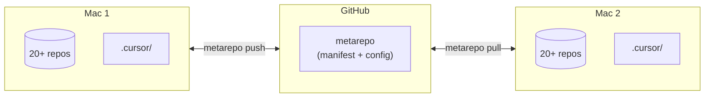
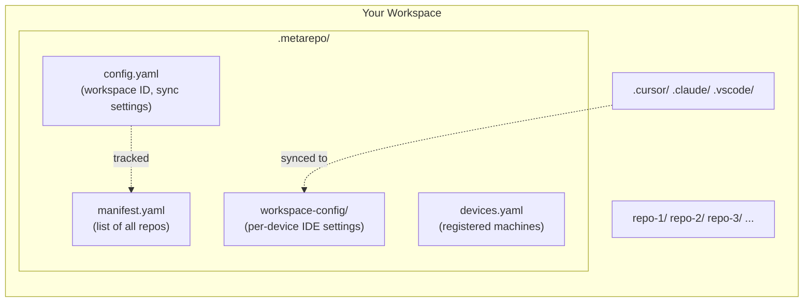
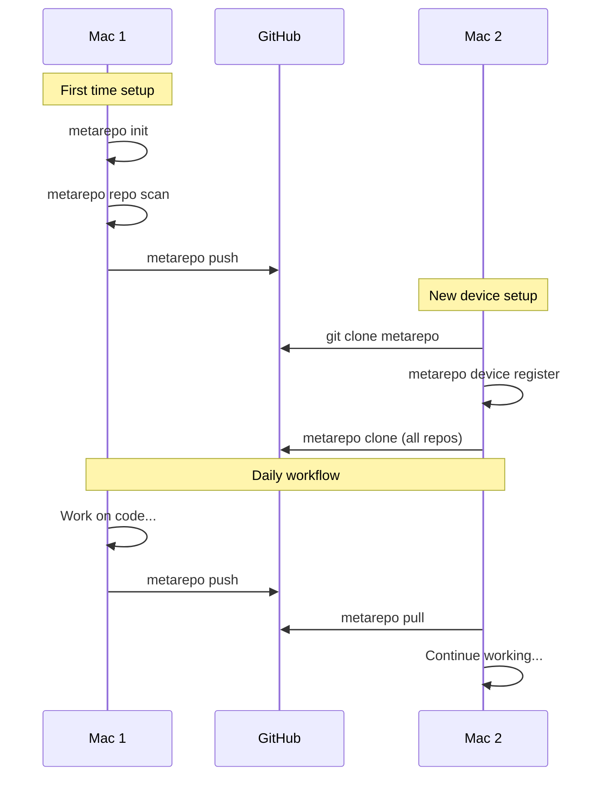

# metarepo-cli

A CLI tool for managing multi-repository workspaces with cross-device synchronization.

## The Problem

Managing multiple git repositories across different machines is painful:
- You have 20+ repos that need to stay in sync
- IDE settings (.cursor, .vscode) differ per machine
- Cloning everything on a new device takes forever
- No single source of truth for "what repos do I have?"

## The Solution

`metarepo-cli` treats your entire workspace as a single unit with a unique ID. Sync everything (repos + config) between devices with one command.

> Works between any two Macs: work & personal, two personal machines, desktop & laptop, etc.



## How It Works



## Features

- **Multi-repo management**: List, status, and operate on all repositories in your workspace
- **Cross-device sync**: Synchronize your workspace configuration between multiple machines
- **Device identification**: Automatic device detection via hardware serial number
- **IDE config sync**: Sync `.cursor/`, `.claude/`, `.vscode/` settings between devices
- **Inventory generation**: Auto-generate `REPOS.md` with repository overview

## Installation

### Homebrew (macOS/Linux)

```bash
brew tap JPlanken/tap
brew install metarepo
```

### From source

```bash
go install github.com/JPlanken/metarepo-cli/cmd/metarepo@latest
```

### Binary releases

Download from [GitHub Releases](https://github.com/JPlanken/metarepo-cli/releases).

## Quick Start

```bash
# Initialize a new workspace
metarepo init

# List all repositories
metarepo repo list

# Check status of all repos
metarepo repo status

# Push all repos and sync config
metarepo push

# Pull all repos (on another device)
metarepo pull

# Generate REPOS.md inventory
metarepo inventory generate
```

## Commands

| Command | Description |
|---------|-------------|
| `metarepo init` | Initialize a new workspace |
| `metarepo push` | Push all repos + sync workspace config |
| `metarepo pull` | Pull all repos + clone new ones from manifest |
| `metarepo clone` | Clone all repos from manifest (new device setup) |
| `metarepo repo list` | List all repositories |
| `metarepo repo status` | Show git status of all repos |
| `metarepo repo add <url>` | Clone and add a repository |
| `metarepo repo scan` | Scan workspace and update manifest |
| `metarepo device info` | Show current device information |
| `metarepo device list` | List all registered devices |
| `metarepo device register` | Register current device |
| `metarepo inventory generate` | Generate REPOS.md |
| `metarepo version` | Show version info |

## Configuration

Configuration is stored in `.metarepo/config.yaml`:

```yaml
version: "1.0"
workspace:
  name: "my-workspace"
  root: "/path/to/workspace"

sync:
  enabled: true
  remote: "git@github.com:user/metarepo.git"
  ide:
    cursor: [".cursor/"]
    claude: [".claude/"]
    vscode: [".vscode/"]

inventory:
  output: "REPOS.md"
```

## Multi-Device Workflow



### First device: Initialize and push
```bash
metarepo init
metarepo repo scan
metarepo push
```

### Second device: Clone and pull
```bash
git clone <metarepo-url> .metarepo
metarepo device register
metarepo clone
metarepo pull --from <first-device-name>
```

## License

MIT
