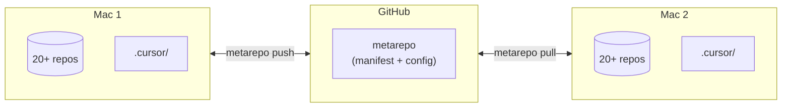
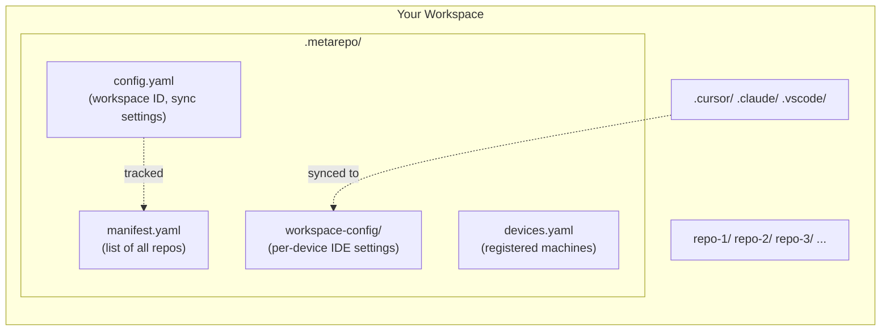
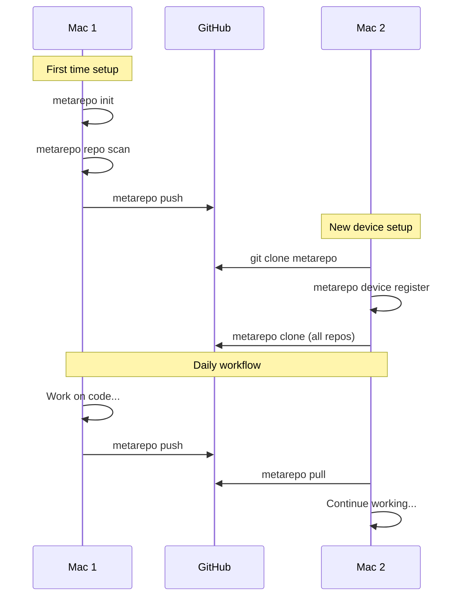

# metarepo-cli

[](https://go.dev/)
[](LICENSE)
[](https://github.com/JPlanken/metarepo-cli/releases)
[](https://github.com/JPlanken/metarepo-cli)

**A command-line tool for managing multiple Git repositories as a single workspace with cross-device synchronization.**

> **TL;DR:** Sync 20+ repos and IDE settings between multiple Macs with one command. Like a monorepo, but for people who prefer separate repositories.

---

## What is metarepo-cli?

`metarepo-cli` is a **multi-repo management tool** that solves the problem of keeping multiple Git repositories synchronized across different machines (e.g., MacBook Pro at work and MacBook Air at home).

Unlike monorepo tools, metarepo-cli lets you keep your repositories separate while managing them as a single unit.

### Key Features

| Feature | Description |
|---------|-------------|
| **Multi-repo sync** | Push/pull all repositories with one command |
| **IDE config sync** | Sync `.cursor/`, `.claude/`, `.vscode/` settings |
| **Device detection** | Automatic identification via hardware serial |
| **Workspace UUID** | Unique ID prevents sync conflicts |
| **Exclude patterns** | Skip repos with wildcard patterns (`temp-*`) |
| **Runtime detection** | Detect Python, Go, Node.js, Rust versions |
| **Inventory generation** | Auto-generate `REPOS.md` overview |

---

## The Problem

Managing multiple Git repositories across different machines is painful:

- You have **20+ repos** that need to stay in sync
- **IDE settings** (Cursor, VS Code, Claude) differ per machine
- **Cloning everything** on a new device takes forever
- **No single source of truth** for "what repos do I have?"

## The Solution

`metarepo-cli` treats your entire workspace as a single unit with a unique ID. Sync everything (repos + config) between devices with one command.

> Works between any two Macs: work & personal, desktop & laptop, two personal machines, etc.



---

## How It Works



---

## Installation

### Homebrew (macOS)

```bash
brew tap JPlanken/tap
brew install metarepo
```

### From Source

```bash
go install github.com/JPlanken/metarepo-cli/cmd/metarepo@latest
```

### Binary Download

Download pre-built binaries from [GitHub Releases](https://github.com/JPlanken/metarepo-cli/releases).

---

## Quick Start

```bash
# 1. Initialize workspace
metarepo init

# 2. Scan existing repos
metarepo repo scan

# 3. Check status
metarepo repo status

# 4. Push everything to remote
metarepo push

# 5. On another device: pull everything
metarepo pull
```

---

## Commands Reference

### Core Commands

| Command | Description |
|---------|-------------|
| `metarepo init` | Initialize a new workspace with UUID |
| `metarepo push` | Push all repos + sync workspace config |
| `metarepo pull` | Pull all repos + clone new ones |
| `metarepo clone` | Clone all repos from manifest |

### Repository Management

| Command | Description |
|---------|-------------|
| `metarepo repo list` | List all repositories |
| `metarepo repo list --all` | Include excluded repos |
| `metarepo repo list --runtimes` | Show detected languages |
| `metarepo repo status` | Show git status of all repos |
| `metarepo repo add <url>` | Clone and register a repo |
| `metarepo repo scan` | Discover repos and update manifest |
| `metarepo repo runtimes` | Detailed runtime info per repo |

### Device & Workspace

| Command | Description |
|---------|-------------|
| `metarepo workspace info` | Show workspace ID, location, sync config |
| `metarepo device info` | Current device serial & registration |
| `metarepo device list` | All registered devices |
| `metarepo device register` | Register current device |

### Utilities

| Command | Description |
|---------|-------------|
| `metarepo inventory generate` | Generate REPOS.md |
| `metarepo version` | Show version info |

---

## Configuration

Configuration is stored in `.metarepo/config.yaml`:

```yaml
version: "1.0"

workspace:
  id: "550e8400-e29b-41d4-a716-446655440000"  # Auto-generated UUID
  name: "my-workspace"
  root: "/Users/you/Projects"

repos:
  exclude:
    - "temp-*"        # Wildcard: all temp repos
    - "archive-*"     # Wildcard: archived repos
    - "test-repo"     # Exact match

sync:
  enabled: true
  remote: "git@github.com:user/metarepo.git"
  ide:
    cursor: [".cursor/"]
    claude: [".claude/"]
    vscode: [".vscode/"]

inventory:
  output: "REPOS.md"
```

### Excluding Repositories

Use `repos.exclude` to skip repositories from sync operations:

```yaml
repos:
  exclude:
    - "temp-*"       # All repos starting with "temp-"
    - "*.backup"     # All backup repos
    - "personal-*"   # Personal repos not for sync
```

Excluded repos are marked with `[EXCL]` in output. Use `--all` flag to include them.

---

## Multi-Device Workflow



### First Device Setup

```bash
metarepo init
metarepo repo scan
metarepo push
```

### Second Device Setup

```bash
git clone <metarepo-url> .metarepo
metarepo device register
metarepo clone
metarepo pull --from <device-name>
```

---

## Use Cases

### 1. Freelancer with Multiple Macs
Sync your entire development environment between your desktop Mac Studio and MacBook Air when working remotely.

### 2. Work + Personal Machine
Keep your side projects in sync between work MacBook and personal MacBook without mixing work repos.

### 3. Team Onboarding
New team member? Share the metarepo URL and they can clone 50+ repos with one command.

### 4. Backup & Recovery
Your workspace manifest serves as documentation of all your projects. Restore your entire setup on a new machine in minutes.

---

## Comparison with Alternatives

| Tool | Multi-repo | Cross-device sync | IDE config sync | Device detection |
|------|------------|-------------------|-----------------|------------------|
| **metarepo-cli** | ✅ | ✅ | ✅ | ✅ |
| [meta](https://github.com/mateodelnorte/meta) | ✅ | ❌ | ❌ | ❌ |
| [mani](https://github.com/alajmo/mani) | ✅ | ❌ | ❌ | ❌ |
| [mu-repo](https://fabioz.github.io/mu-repo/) | ✅ | ❌ | ❌ | ❌ |
| git submodules | ✅ | ❌ | ❌ | ❌ |

**What makes metarepo-cli different:** Built specifically for syncing workspaces between multiple machines, not just managing repos on one machine.

---

## FAQ

### What platforms are supported?
Currently **macOS** (Intel and Apple Silicon). Linux support is planned.

### How does device detection work?
metarepo-cli uses your Mac's hardware serial number (via `ioreg`) to uniquely identify each device.

### Can I use this with a team?
Yes! Share the metarepo Git URL. Each team member registers their device and can sync all repos.

### What about private repos?
Works with any Git remote you have access to (GitHub, GitLab, Bitbucket, self-hosted).

### How is this different from a monorepo?
A monorepo puts all code in one repository. metarepo-cli keeps repos separate but manages them together. You get the benefits of organization without the complexity of a monorepo build system.

### Can I exclude sensitive repos?
Yes, use `repos.exclude` patterns to skip repos from sync operations.

---

## Built With

- [Go](https://go.dev/) - Programming language
- [Cobra](https://cobra.dev/) - CLI framework (used by Docker, Kubernetes, GitHub CLI)
- [Viper](https://github.com/spf13/viper) - Configuration management
- [GoReleaser](https://goreleaser.com/) - Release automation

---

## License

MIT License - see [LICENSE](LICENSE) file.

---

## Links

- [GitHub Repository](https://github.com/JPlanken/metarepo-cli)
- [Releases](https://github.com/JPlanken/metarepo-cli/releases)
- [Issues](https://github.com/JPlanken/metarepo-cli/issues)

---

<p align="center">
  <sub>Built for developers who work across multiple machines.</sub>
</p>
